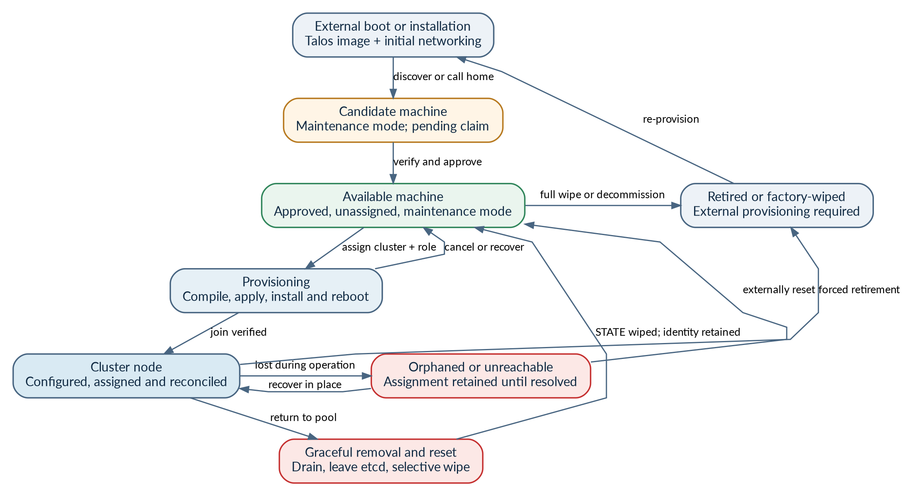
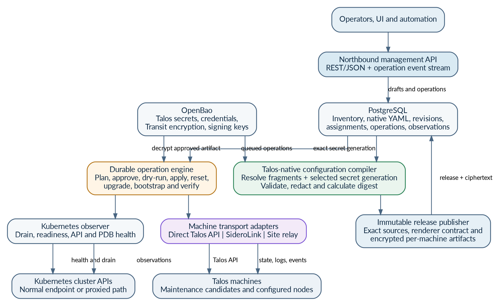
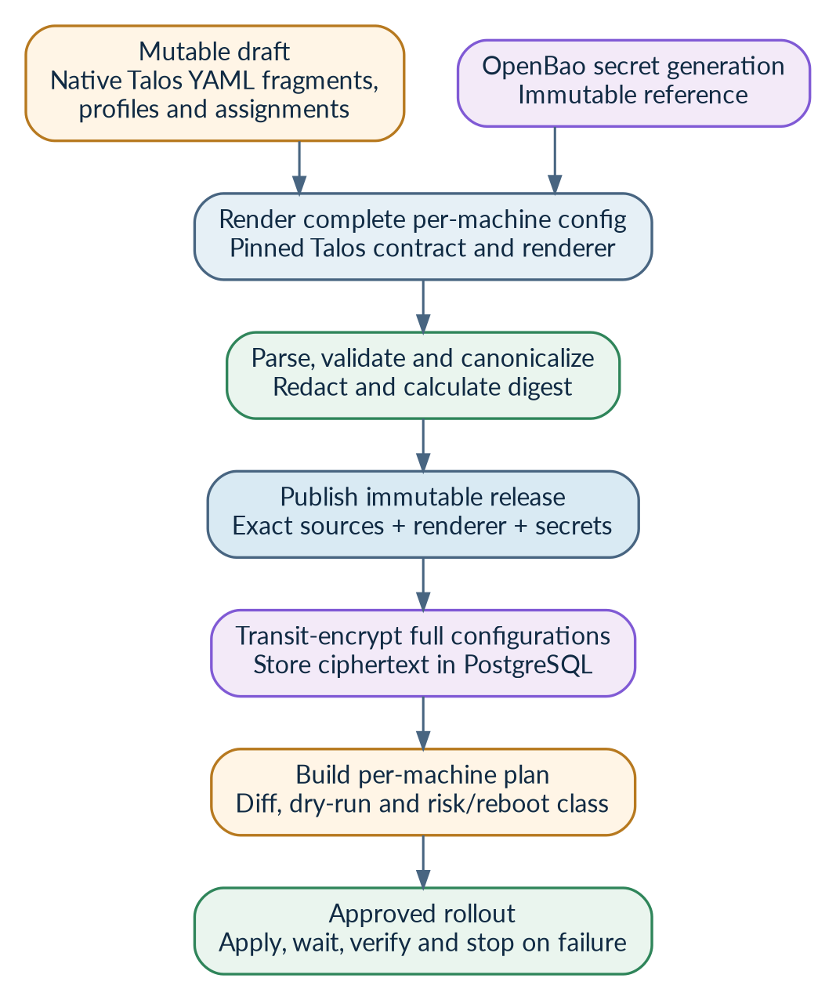
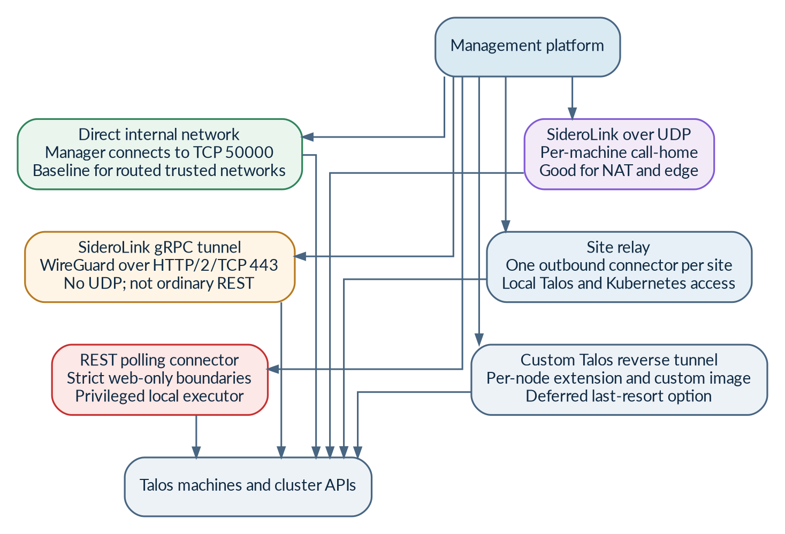

# Talos Configuration and Machine Management Platform

*Complete design concept, Omni comparison and option analysis*

| **Document status**    | Working architecture concept - not yet an implementation specification                                                               |
|------------------------|--------------------------------------------------------------------------------------------------------------------------------------|
| **Revision**           | 0.3                                                                                                                                  |
| **Date**               | 3 August 2026                                                                                                                        |
| **Technical baseline** | Talos Linux 1.13 (v1.13.6); Omni 1.9 (v1.9.3); OpenBao 2.6 (v2.6.1) documentation                                                  |
| **Scope**              | Talos configuration, secrets and machine lifecycle as an open alternative control plane, without CAPI or infrastructure provisioning |

> **Purpose:** This document consolidates the full design discussion so far: the problem being solved, the architecture and lifecycle workflows, the backend and security model, the comparison with Omni, and the design alternatives that remain open.

| **Revision** | **Changes** |
|--------------|-------------|
| 0.1          | Initial concept notes. |
| 0.2          | Consolidated design, lifecycle workflows, backend and security model, Omni comparison. |
| 0.3          | External technical review: version baseline updated (Omni 1.7 -> 1.9.3, OpenBao 2.6.1, Talos v1.13.6); corrected SideroLink endpoint/port wording, Talos apply-mode list and reset-wipe defaults; citation and reference-URL fixes; added installer-image sourcing, etcd backups, multi-version renderer, implementation language and project licence considerations; Omni comparison refreshed for 1.8/1.9. |

## Contents

- [Executive summary](#executive-summary)
- [1. Problem statement and design intent](#1-problem-statement-and-design-intent)
- [2. How the concept evolved](#2-how-the-concept-evolved)
- [3. Current decisions, preferences and open points](#3-current-decisions-preferences-and-open-points)
- [4. Terminology and state model](#4-terminology-and-state-model)
- [5. System architecture](#5-system-architecture)
- [6. Talos-native configuration model](#6-talos-native-configuration-model)
- [7. PostgreSQL and OpenBao backend design](#7-postgresql-and-openbao-backend-design)
- [8. Machine identity, discovery and enrolment](#8-machine-identity-discovery-and-enrolment)
- [9. Machine and cluster lifecycle workflows](#9-machine-and-cluster-lifecycle-workflows)
- [10. Connectivity and transport options](#10-connectivity-and-transport-options)
- [11. Northbound web API](#11-northbound-web-api)
- [12. Reconciliation, rollout and drift](#12-reconciliation-rollout-and-drift)
- [13. Security model](#13-security-model)
- [14. Reliability, high availability and disaster recovery](#14-reliability-high-availability-and-disaster-recovery)
- [15. Observability and operational support](#15-observability-and-operational-support)
- [16. Design options still under consideration](#16-design-options-still-under-consideration)
- [17. Recommended baseline and initial scope](#17-recommended-baseline-and-initial-scope)
- [18. Phased implementation and proof of concept](#18-phased-implementation-and-proof-of-concept)
- [19. Risks, unknowns and next design questions](#19-risks-unknowns-and-next-design-questions)
- [20. Comparison with Omni](#20-comparison-with-omni)
- [Appendix A. Example data and API shapes](#appendix-a-example-data-and-api-shapes)
- [Appendix B. Operation catalogue](#appendix-b-operation-catalogue)
- [Appendix C. References](#appendix-c-references)

## Executive summary

We are designing an open, self-hosted Talos control plane for organisations that already own the infrastructure beneath their clusters. It manages already-booted Talos machines and existing Talos clusters: compose and protect complete machine configurations, apply and verify changes, enrol maintenance-mode machines, create clusters from assigned machines, and reset or reuse machines safely.

At this scope, Omni is the reference implementation and primary comparison. Omni already provides machine enrolment, Talos configuration generation, scoped native patches, automatic reconciliation, cluster creation, upgrades, machine reuse and existing-cluster import. The proposal is therefore not configuration management that Omni lacks; it is a deliberately different control and ownership model. [M1] [M2] [M5]

The intended differentiators are operator custody of native Talos configuration and cluster secrets, first-class reusable fragments and profiles across clusters, explicit draft/publish/approve releases, source provenance and managed drift, optional rather than constitutive transport, retained direct Talos access, infrastructure provisioning outside the product, and an open-source licensing target.

The emerging architecture uses native Talos multi-document YAML and Talos APIs as the canonical configuration model, PostgreSQL as the authoritative operational and revision database, and OpenBao for Talos secret bundles, management credentials, key material and cryptographic services. Git is not the backend. Talhelper is not required. CAPI is explicitly avoided.

The connectivity layer is deliberately transport-independent. For routed internal environments, direct access to each machine on the Talos API is the simplest baseline. SideroLink remains an optional call-home transport for NAT, edge or less trusted networks; its grpc_tunnel mode avoids UDP by carrying WireGuard traffic over the long-lived SideroLink gRPC connection on TCP; the SideroLink endpoint URL and port are deployment-defined, commonly exposed on 443. A site relay is another option for reaching an entire remote network through one outbound web-compatible connector. [T1]

> **Current recommended baseline:** First prove the configuration-specific differentiators on direct internal networks: native fragment/profile reuse, OpenBao custody, immutable releases, approvals, provenance, drift handling and reset/reuse. Add SideroLink-over-gRPC and site-relay transports later. If these differentiators are not hard requirements, Omni is the rational choice and rebuilding it would be unjustified.

## 1. Problem statement and design intent

### 1.1 The gap

Omni is the closest existing product and already covers most of the machine and cluster lifecycle described here. The gap is not a missing ability to generate and reconcile Talos configurations. It is the combination of ownership and workflow requirements: external secret custody, native configuration as an operator-owned asset, first-class cross-cluster reuse, immutable releases and approvals, direct or site-native connectivity, a conventional web API, and an open licence. [M1] [M2] [M4]

The desired product is therefore best understood as a configuration-centric, transport-agnostic alternative Talos control plane - not merely a hosted Talhelper and not a generic infrastructure platform. It should borrow proven Omni semantics where they are sound and diverge only where a stated requirement demands it.

### 1.2 Primary goals

| **Goal**                                         | **Meaning**                                                                                                                       |
|--------------------------------------------------|-----------------------------------------------------------------------------------------------------------------------------------|
| Manage complete Talos configuration              | Compose, validate, version, approve, apply and verify full native machine configuration, including secret-bearing fields.         |
| Manage secrets correctly                         | Keep cluster PKI and credentials in OpenBao, track immutable secret generations, and bind each release to an exact generation.    |
| Support reusable YAML                            | Use focused native Talos YAML fragments, named profiles, explicit merge order and local YAML anchors where useful.                |
| Manage both unconfigured and configured machines | Handle maintenance-mode candidates, available machines, active cluster nodes, failed provisioning, reset-to-pool and retirement.  |
| Operate existing clusters                        | Adopt running clusters without resetting them, establish a baseline, add management connectivity and preserve break-glass access. |
| Create clusters without CAPI                     | Assign available machines, generate role-specific configuration, apply it, bootstrap etcd once and verify Kubernetes.             |
| Expose a real web API                            | Provide a stable REST/JSON API for users, automation and a future UI, independent of the southbound Talos transport.              |
| Survive management-plane failure                 | Managed clusters must continue running normally if PostgreSQL, OpenBao or the manager is temporarily unavailable.                 |

### 1.3 Explicit non-goals

| **Non-goal**                            | **Boundary**                                                                                                                 |
|-----------------------------------------|------------------------------------------------------------------------------------------------------------------------------|
| No CAPI dependency                      | Do not model desired VM counts, infrastructure providers, MachineDeployments or provider-specific replacement workflows.     |
| No VM or hardware creation              | Do not create VMs, operate hypervisors, allocate cloud instances, control Redfish/BMC, or run PXE in the initial product.    |
| No Git backend                          | Git export may exist, but Git is not the authoritative desired-state or revision store.                                      |
| No Talhelper runtime dependency         | Talhelper may later be an import adapter, but the core consumes native Talos semantics directly.                             |
| No Kubernetes workload GitOps           | The platform may observe Kubernetes for health and drain operations, but it is not Flux, Argo CD or an application platform. |
| No mandatory KubeSpan                   | Cluster data-plane networking remains outside this design unless a specific cluster independently chooses KubeSpan.          |
| No proprietary Talos replacement schema | Do not recreate every Talos option behind another platform API.                                                              |

### 1.4 Guiding principles

- **Talos owns machine semantics.** The platform owns composition, secrets, approval, transport, rollout and audit.

- **Thin management metadata.** Machine assignments and profile ordering may be platform-specific; actual machine settings remain native Talos YAML.

- **Transport is a replaceable implementation detail.** Direct TCP, SideroLink and site relay must feed the same operation engine.

- **Destructive actions are workflows.** Reset, wipe, bootstrap and upgrades require durable state, locks, idempotency and explicit verification.

- **Configuration publication is immutable.** Drafts are mutable; releases, source references, renderer versions and secret generations are not.

- **Break-glass independence.** The manager should improve control without becoming the only remaining route to recovery.

- **Boring data integrity beats cleverness.** PostgreSQL handles relational state and transactional publication; OpenBao handles secrets and cryptography.

- **Omni is the reference baseline, not a straw man.** Reuse proven scope, safety, import and lifecycle ideas; do not rebuild features merely to be different.

## 2. How the concept evolved

The discussion initially surveyed known Talos tools. Those tools were useful for defining the negative space, but they did not match the desired concept. The design then converged through the following steps:

| **Evolution step**                            | **Result**                                                                                                                                                                                                              |
|-----------------------------------------------|-------------------------------------------------------------------------------------------------------------------------------------------------------------------------------------------------------------------------|
| Tool survey rejected as the answer            | Talhelper, Talm, operators and CAPI-based systems either remained local push tools or focused on provisioning and cluster infrastructure rather than post-install configuration control.                                |
| Product category identified                   | A persistent Talos configuration and machine control plane: configuration compiler, secret broker, inventory, connection layer and reconciler.                                                                          |
| Talhelper made optional, then unnecessary     | The clean core can use upstream Talos generation, multi-document configuration, patching, validation and Machine API operations directly.                                                                               |
| Git removed from the architecture             | PostgreSQL now provides drafts, immutable revisions, relationships, approvals, operations and observations. Export remains desirable, but Git is not authoritative.                                                     |
| OpenBao introduced                            | OpenBao stores Talos secret generations and management credentials; Transit can encrypt full compiled configurations stored in PostgreSQL.                                                                              |
| CAPI explicitly excluded                      | Cluster creation means assigning existing Talos machines, applying configurations and bootstrapping once - not owning infrastructure resources.                                                                         |
| Machine lifecycle widened                     | The system must distinguish pending maintenance machines, available machines, active nodes, resets, orphans and full retirement.                                                                                        |
| Connectivity separated from control logic     | Direct internal access, SideroLink, a site relay and a hypothetical custom extension are alternative transports behind one interface.                                                                                   |
| Web API clarified                             | The northbound user API should be REST regardless of southbound transport. A restrictive remote-site use case may additionally require an outbound web-compatible connector.                                            |
| Omni reframed as the reference implementation | The concept overlaps substantially with Omni. The comparison shifted from a supposedly missing category to an alternative ownership, release and transport model.                                                       |
| Configuration novelty narrowed                | Generated base plus native patches plus effective config plus reconciliation is not new. Candidate value lies in profiles, explicit releases, external secret custody, provenance, direct access and a clean exit path. |

## 3. Current decisions, preferences and open points

| **Topic**                        | **Current position**                                                                                                   | **Status**         |
|----------------------------------|------------------------------------------------------------------------------------------------------------------------|--------------------|
| Canonical machine configuration  | Native Talos multi-document YAML and upstream Talos semantics                                                          | Decided            |
| Reusable configuration           | Named fragments and ordered profiles; YAML anchors only within a stored document                                       | Preferred          |
| Talhelper                        | Not required; possible import adapter later                                                                            | Decided            |
| Git                              | Not the backend; export/import only                                                                                    | Decided            |
| Relational backend               | PostgreSQL, preferably CloudNativePG in the reference deployment                                                       | Preferred          |
| Secret backend                   | OpenBao KV v2 plus Transit; OpenBao itself uses integrated Raft                                                        | Preferred          |
| CAPI                             | Avoided and outside scope                                                                                              | Decided            |
| Infrastructure provisioning      | Outside initial scope                                                                                                  | Decided            |
| Northbound interface             | REST/JSON web API with asynchronous operations and event streaming                                                     | Preferred          |
| Default southbound transport     | Direct Talos API on internal management networks                                                                       | Recommended        |
| Remote/NAT transport             | SideroLink, preferably grpc_tunnel where UDP is unavailable                                                            | Open option        |
| Strict web-only remote transport | Site relay or REST-polling connector                                                                                   | Open option        |
| Custom Talos extension           | Deferred last resort                                                                                                   | Deferred           |
| Kubernetes API path              | Normal cluster endpoint for direct sites; proxy/relay only where required                                              | Preferred          |
| Drift correction                 | Report by default; operator chooses revert or adopt                                                                    | Preferred          |
| Automatic rollout                | Conservative, policy-controlled; destructive and control-plane actions require approval                                | Preferred          |
| Omni relationship                | Primary reference implementation and competitor; avoiding CAPI is not by itself a distinction from Omni                | Decided            |
| Build/no-build gate              | Proceed only if several differentiators are hard requirements; otherwise adopt Omni                                    | Architectural gate |
| Configuration source classes     | Separate machine configuration, identity/secrets, image/extensions, kernel/early-boot arguments and platform injection | Preferred          |
| Implementation language          | Go, single static management binary; aligns with upstream Talos client machinery and talosctl                          | Preferred          |
| Project licence                  | OSI-approved licence required; exact licence (Apache-2.0, AGPLv3, MPL-2.0) not yet chosen                              | Open point         |

> **Important:** “Open option” does not mean the architecture is undefined. It means the core is deliberately designed so that the option can be selected per environment without changing configuration, secrets or lifecycle semantics.

## 4. Terminology and state model

### 4.1 Machine versus node

A **machine** is a Talos-capable compute instance known to the manager. A **cluster node** is a machine currently configured and assigned to a Kubernetes cluster. This distinction matters because maintenance-mode systems have no cluster identity, while a reset machine may retain its stable manager identity even after its Kubernetes Node object and Talos cluster credentials are gone.

### 4.2 Primary lifecycle categories

| **Category**         | **Definition**                                                                                                      |
|----------------------|---------------------------------------------------------------------------------------------------------------------|
| Candidate machine    | Talos is in maintenance mode; the manager has observed it but has not approved or claimed it.                       |
| Available machine    | Approved, unassigned and ready to receive a cluster role/configuration.                                             |
| Provisioning machine | A full configuration is being compiled, applied, installed or verified.                                             |
| Cluster node         | Configured, assigned to a cluster and actively reconciled.                                                          |
| Orphaned machine     | The manager cannot prove the machine completed its assigned operation or still matches its recorded identity/state. |
| Retired machine      | Decommissioned or fully wiped; automatic return requires external provisioning.                                     |

### 4.3 Orthogonal state dimensions

A single giant enum would produce an unmanageable number of combinations. The database should model several dimensions separately and derive user-facing states from them.

| **Dimension** | **Example values**                                                      |
|---------------|-------------------------------------------------------------------------|
| Enrolment     | pending, approved, rejected, revoked                                    |
| Talos mode    | maintenance, configured, unknown                                        |
| Assignment    | unassigned, cluster/controlplane, cluster/worker, retired               |
| Connectivity  | connected, reachable, disconnected, unknown                             |
| Operation     | idle, applying, installing, resetting, upgrading, wiping, bootstrapping |
| Health        | healthy, degraded, failed, unknown                                      |
| Configuration | desired, applied, observed, plus digest equality/drift                  |



*Figure 1 - Proposed machine lifecycle. A full factory wipe deliberately leaves the managed lifecycle and requires an external boot/install mechanism.*

### 4.4 Identity layers

| **Identity**               | **Lifetime and purpose**                                                                                 |
|----------------------------|----------------------------------------------------------------------------------------------------------|
| Manager machine ID         | Stable UUID allocated by this platform; survives reset, hostname changes and cluster reassignment.       |
| Hardware or VM fingerprint | SMBIOS UUID, serial, MACs, TPM identity and device information; evidence, not an infallible primary key. |
| Enrolment identity         | Per-machine credential used for call-home or claim; revocable and independent of cluster PKI.            |
| Talos cluster identity     | Machine and cluster credentials generated from the selected Talos secret generation.                     |
| Kubernetes node identity   | Node name and UID for the current cluster assignment; expected to change after reset/reuse.              |

## 5. System architecture

The platform separates user-facing management, persistent desired state, secret handling, configuration compilation, durable operations and network transport. This separation prevents any one transport or authoring convenience from becoming the product architecture.



*Figure 2 - High-level component architecture.*

### 5.1 Core components

| **Component**           | **Responsibility**                                                                                                                                            |
|-------------------------|---------------------------------------------------------------------------------------------------------------------------------------------------------------|
| Management API and UI   | Authentication, RBAC, drafts, review, release publication, operations, inventory and audit views.                                                             |
| PostgreSQL              | Authoritative inventory, YAML sources, profiles, immutable revisions, assignments, releases, operation journals and observations.                             |
| OpenBao                 | Talos secret bundles, management credentials, enrolment signing material, Transit encryption and component authentication.                                    |
| Configuration compiler  | Resolves ordered native fragments, retrieves an exact secret generation, uses a pinned Talos contract, validates and produces per-machine full configuration. |
| Release publisher       | Creates immutable releases and encrypted per-machine artifacts, including redacted structural diffs and source provenance.                                    |
| Operation engine        | Executes idempotent, resumable workflows: apply, install, bootstrap, reset, upgrade, wipe and recovery.                                                       |
| Machine transport layer | Direct TCP, SideroLink or site relay; exposes a uniform Talos API connection to the operation engine.                                                         |
| Kubernetes observer     | Uses the normal Kubernetes API or a proxied path for drain, Node readiness, PDB failures and cluster health.                                                  |
| Observability and audit | Metrics, event streams, machine logs, operation timeline, application audit and OpenBao audit records.                                                        |

### 5.2 Hard architectural boundaries

- The API/UI must never receive raw access to all OpenBao secret material.

- The configuration compiler may read selected secret generations but should not execute machine operations.

- The reconciler should normally decrypt only already-approved compiled artifacts, not freely browse all Talos cluster secrets.

- The transport layer moves authenticated Talos API traffic; it does not decide desired state.

- The Kubernetes observer informs lifecycle decisions but does not own workloads.

- Managed clusters must not depend on the management platform for normal Kubernetes control-plane or data-plane operation.

## 6. Talos-native configuration model

### 6.1 Canonical model

Talos machine configuration is a multi-document YAML configuration. Talos parses documents independently and merges them sequentially, with later documents taking precedence. Talos also supports strategic-merge patches and RFC 6902 JSON patches, although multi-document composition naturally favours strategic merge and full native documents. [T3] [T4]

> **Decision:** The platform canonical desired-state model is native Talos machine configuration. Platform metadata selects and orders fragments but does not redefine Talos fields.

### 6.2 Fragments, profiles and assignments

A **fragment** is an immutable revision of native Talos YAML. A **profile** is an ordered list of fragment revisions. A **machine assignment** selects cluster-wide, role, site, hardware and machine-specific profiles/fragments. The compiler evaluates them in an explicit order.

> Composition order: machine-intrinsic -> global defaults -> site -> cluster -> role or machine set -> workload profile -> cluster-machine override. Fragment order is explicit inside each layer.

This makes reuse visible and traceable. The UI should be able to show which fragment last set any field. Field provenance is more valuable than clever templating because it makes the final configuration explainable.

The layer hierarchy should remain small and fixed. Profiles provide reuse inside those layers; they should not permit an arbitrary 47-stage patch lasagne that is harder to reason about than the machine configuration it replaces. The seven layers in the composition order above are the fixed superset: deployments select among them but must not define additional layers.

Omni's precedence model - Machine, Cluster, MachineSet, then ClusterMachine - captures a useful semantic distinction. Intrinsic machine properties survive reassignment but have lower precedence than the machine's current cluster role and assignment. This platform should preserve that distinction even if its resource names differ. [M2]

### 6.3 YAML anchors

YAML anchors remain valid authoring syntax inside a stored YAML document. They should not be the cross-document inheritance mechanism because anchors are document-local and are usually lost after parsing. Cross-file reuse belongs in named profiles and fragment references.

### 6.4 No required Talhelper layer

Talhelper is convenient for local repository workflows, but it is not necessary in this server architecture. The platform already needs its own inventory, secret retrieval, revision model, publication, audit and rollout engine. Adding Talhelper would introduce a second configuration schema and version dependency without removing the hard platform work.

A future importer could accept an existing Talhelper project and translate it into native fragment/profile records. This preserves migration convenience without making Talhelper part of the control plane.

### 6.5 Renderer and contract pinning

Every published release must record the target Talos version, Kubernetes version, Talos configuration contract, renderer implementation/version, installer image or schematic, and system extensions. Regenerating a historical release with a newer manager must not silently produce different output. Because different clusters will run different Talos versions at any given time, the renderer must support multiple pinned Talos contract versions concurrently; with the subprocess approach this means one pinned talosctl binary per contract in use.

The first implementation can invoke a pinned talosctl in an isolated process. A later implementation can use Talos Go machinery directly for better typed errors, redaction and provenance. Both are upstream-only approaches; the trade-off is subprocess simplicity versus library integration and compatibility maintenance.

### 6.6 Release pipeline



*Figure 3 - Draft-to-release and rollout pipeline.*

Publication should compile and validate the complete per-machine configurations before a release becomes available. The exact full configuration is secret-bearing and should be encrypted before persistence. The release also stores a redacted canonical form, digest, source graph and validation results.

Compared with Omni, publication deliberately decouples authoring from activation. In Omni, saving or syncing a patch updates desired state and the controller applies it to the targeted machines; configuration history shows pending and applied changes. Here, an immutable Release is an explicit review boundary before rollout. [M2] [M6]

### 6.7 Configuration source classes

Not every input that changes a Talos machine should be forced into one generic patch stream. The inputs have different ownership, precedence and apply semantics.

| **Source class**                | **Examples**                                                              | **Proposed treatment**                                                                                             |
|---------------------------------|---------------------------------------------------------------------------|--------------------------------------------------------------------------------------------------------------------|
| Machine configuration fragments | Networking, kubelet, registries, sysctls, cluster component settings      | Native Talos YAML, composed through fixed layers and ordered fragment revisions.                                   |
| Cluster identity and secrets    | Cluster ID/name, CAs, tokens, machine credentials, control-plane endpoint | Dedicated cluster and secret-generation resources; injected by the compiler and protected from ordinary fragments. |
| Image and extensions            | Installer image or schematic, system extensions, firmware, kernel modules | Dedicated release input because changes normally imply an install or Talos upgrade cycle.                          |
| Kernel and early-boot arguments | Bootstrap network, console options, SideroLink join arguments             | Dedicated enrolment/release input with reboot and boot-asset implications.                                         |
| Platform/bootstrap injection    | talos.config URL, cloud metadata or user-data                             | Observed and imported as a separate source; never assumed to merge with the persisted full configuration.          |
| Talos defaults                  | Version-specific default behaviour                                        | Pinned through the target Talos generation contract and renderer version.                                          |
| Kubernetes manifests            | Bootstrap or continuously reconciled workloads                            | Outside version 1; managed by a Kubernetes workload system rather than hidden inside machine configuration.        |

Omni independently models patches, ExtensionsConfigurations, KernelArgs, Kubernetes manifests, platform injection and Talos defaults. That separation is operationally correct. The proposed platform should not appear cleaner by collapsing inputs that require different lifecycle behaviour. [M2] [M3]

Installer images and schematics are a sourcing dependency in their own right. Talos images that include system extensions are normally produced by the public Image Factory or a self-hosted Image Factory instance; Omni 1.8 added an Image Factory proxy for exactly this reason. [T15] [M9] Version 1 should treat schematic IDs and installer image references as opaque, pinned release inputs, but the deployment documentation must state where images are built and whether air-gapped sites require a local Image Factory.

### 6.8 What the configuration design does and does not add

> **Not novel:** generated base configuration + ordered native Talos patches -> effective per-machine configuration -> Talos API reconciliation. Omni already implements this core mechanism.

The intended additions are operator-owned identity and secrets, a first-class cross-cluster fragment/profile library, immutable release artifacts, exact field provenance, explicit approval, desired/applied/observed tracking, controlled drift adoption, transport independence and exportability. Section 20 compares these boundaries in detail.

Without those features, this subsystem would largely be a younger and less capable reproduction of Omni's configuration controller.

## 7. PostgreSQL and OpenBao backend design

### 7.1 Responsibility split

| **Data or concern**                      | **System**                         | **Reason**                                         |
|------------------------------------------|------------------------------------|----------------------------------------------------|
| Clusters, machines and assignments       | PostgreSQL                         | Relationships, queries and transactional updates   |
| Native YAML source and revision history  | PostgreSQL                         | Original text plus canonical parsed representation |
| Drafts, approvals and immutable releases | PostgreSQL                         | Optimistic concurrency and append-only publication |
| Operation journal and observations       | PostgreSQL                         | Durable workflows and queryable status             |
| Talos cluster secret bundles             | OpenBao KV v2                      | Versioned, policy-controlled secret storage        |
| Talos API and Kubernetes credentials     | OpenBao                            | Restricted component access                        |
| Enrolment keys and signing material      | OpenBao                            | Revocable machine identity and token issuance      |
| Compiled full machine config             | Encrypted ciphertext in PostgreSQL | Transit key/version stored with artifact           |
| Application audit metadata               | PostgreSQL                         | Who changed, approved and executed what            |
| Secret access audit                      | OpenBao audit devices              | Every OpenBao API request/response is auditable    |

### 7.2 PostgreSQL revision model

The database must deliberately reproduce the useful properties that Git would otherwise provide: immutable commits, diffs, authorship, optimistic conflict detection and rollback. A single mutable machine_config row is insufficient.

```text
config_fragments
config_fragment_revisions
profiles
profile_revisions
profile_revision_fragments
cluster_drafts
machine_assignments
secret_generations
config_releases
compiled_machine_configs
rollouts
rollout_steps
machine_observations
audit_events
```

Store the original YAML as TEXT so comments, formatting and anchors can be preserved for editing. Also store a canonical parsed representation, likely JSONB, for structural diffing, validation results and targeted queries. The canonical representation is an index and analysis aid, not the authoring language.

### 7.3 OpenBao usage

OpenBao KV v2 provides versioned secret storage and check-and-set semantics. The platform should still treat each Talos secret generation as a separate immutable application-level object rather than relying only on “latest version” at a mutable path. [O3]

OpenBao Transit is designed to encrypt application data that remains stored in another primary datastore. It is therefore suitable for encrypting complete rendered Talos configurations stored as ciphertext in PostgreSQL. OpenBao does not store the submitted plaintext. [O2]

OpenBao itself should use its integrated Raft storage, which provides HA and backup/restore workflows, rather than sharing the application PostgreSQL database. This keeps the secret system and the application database independently recoverable. [O1]

OpenBao also officially supports PostgreSQL as a storage backend. Sharing the application PostgreSQL instance would nonetheless couple secret availability, failure modes and recovery to the application database, and upstream recommends integrated storage for most deployments, so this design keeps OpenBao on its own Raft cluster. [O1] Recent OpenBao releases add capabilities worth tracking: namespaces (2.3) and per-namespace sealing (2.6) align with a possible later hard multi-tenancy requirement, and declarative self-initialization (2.4) simplifies a reproducible reference deployment.

### 7.4 Publication without distributed transactions

PostgreSQL and OpenBao do not share a transaction. Avoid two-phase commit. Use a monotonic publication protocol:

> **1.** Create or select an immutable OpenBao secret generation.
>
> **2.** Confirm the exact generation is readable under the compiler identity.
>
> **3.** Compile and validate every per-machine configuration.
>
> **4.** Encrypt each full configuration through Transit.
>
> **5.** Commit the immutable release, source references and ciphertext in one PostgreSQL transaction.
>
> **6.** Only then make the release eligible for rollout.

If the PostgreSQL transaction fails, the result is an unused OpenBao generation or encryption operation, not a published broken release. A consistency controller can identify and garbage-collect unreferenced secret generations according to retention policy.

### 7.5 Secret rotation

Secret rotation creates a new immutable generation and a new configuration release. The manager must track which machines still use the old generation and must not retire it until the appropriate Talos PKI rotation procedure has completed. “Newest secret” is never an acceptable implicit runtime reference.

## 8. Machine identity, discovery and enrolment

### 8.1 The bootstrap boundary

A manager cannot control a blank disk or a machine with no usable network. The product begins after Talos has booted from an installed image, ISO, PXE or another external mechanism and can acquire enough initial configuration to establish networking or expose the maintenance API. Talos can load configuration from STATE, platform metadata, talos.config, early/inline kernel arguments, embedded configuration, or finally enter maintenance mode. [T2]

> **Boundary:** The platform may orchestrate Talos installation and reset after Talos is reachable, but it does not initially own the external mechanism that puts Talos on an empty machine.

### 8.2 Direct-network enrolment

On an isolated internal provisioning network, the simplest model is pre-created inventory or DHCP-based discovery. The manager connects directly to TCP 50000. In maintenance mode, Talos uses a self-signed server certificate, the client supplies no certificate, neither side authenticates the other, and only a restricted set of setup/maintenance commands is available. This is acceptable only behind strong network isolation and operator claim controls. [T6]

A direct deployment therefore needs at least one of:

- A dedicated provisioning or management VLAN reachable only by the manager and approved operators.

- Stable DHCP reservations or a DHCP lease integration so the manager can map machine inventory to addresses.

- Persistent early network configuration for static-IP environments; if static networking exists only in STATE, a reset may make the machine unreachable.

- An explicit operator claim step that verifies serial, MAC, console identifier or other evidence before a full configuration is applied.

### 8.3 Web-based one-time enrolment without SideroLink

Talos on the metal platform can fetch configuration from a talos.config URL. The manager could expose a one-time HTTPS enrolment endpoint that returns a partial initial configuration, records the request and token, and leaves the machine in maintenance mode for a direct push. This is call-home for discovery, not a persistent reverse management channel. [T2]

```text
Talos boot arguments
  talos.config=https://manager.internal/enrol/<single-use-token>

Talos -> HTTPS request -> Manager
Manager -> records candidate + returns partial bootstrap config
Manager -> direct maintenance API on TCP 50000
```

### 8.4 SideroLink enrolment

SideroLink is Talos-native call-home. The machine establishes a gRPC connection to a SideroLink API server, receives point-to-point WireGuard overlay addresses and keeps the link alive. When grpc_tunnel=true, the WireGuard packets are carried over the same gRPC connection rather than plain UDP. [T1]

When SideroLink is configured, the maintenance-mode API listens exclusively on the SideroLink network. This improves isolation but makes the SideroLink headend part of reset and recovery. [T1]

### 8.5 Claim and trust workflow

- A first contact creates a **pending candidate**, never an automatically trusted machine.

- Shared bootstrap tokens grant only the right to appear in quarantine; they must not expose cluster secrets.

- Approval binds observed evidence to a stable manager machine ID and issues or records a per-machine enrolment identity.

- Duplicate SMBIOS UUIDs, reused MAC addresses and cloned VM templates must be detected rather than merged silently.

- TPM-backed attestation may be added later, but the v1 workflow should not depend on it.

- Revocation must prevent a retired or stolen machine from reclaiming its previous manager identity.

## 9. Machine and cluster lifecycle workflows

### 9.1 Adopt an existing configured cluster

Adoption is a distinct workflow because current running configuration is initially authoritative. A safe process is:

> **1.** Import an administrative Talos client configuration and Kubernetes kubeconfig into a temporary privileged adoption session.
>
> **2.** Connect to each known node directly and record machine evidence, effective configuration, Talos version and cluster membership.
>
> **3.** Import or reconstruct the Talos cluster secret bundle and store it as an OpenBao secret generation.
>
> **4.** Create an immutable baseline release representing the current state, including per-node differences.
>
> **5.** Optionally refactor that baseline into shared fragments and profiles, proving the regenerated output is equivalent before publication.
>
> **6.** Add the desired long-term management transport and observability configuration through a controlled live apply.
>
> **7.** Verify all machines and the Kubernetes API are reachable through the selected management paths.
>
> **8.** Declare the manager release authoritative and retain an independently encrypted break-glass Talos configuration.

Two import modes should eventually exist: **exact adoption**, which preserves current per-node configuration verbatim, and **reconstructed adoption**, which builds a cleaner shared model after equivalence checks.

### 9.2 Enrol and assign a maintenance-mode machine

> **1.** Discover or receive call-home from a Talos maintenance machine.
>
> **2.** Place it in pending quarantine and collect non-sensitive inventory.
>
> **3.** Verify and approve the machine, creating a stable manager identity.
>
> **4.** Assign cluster, role, profiles and machine-specific fragments.
>
> **5.** Compile the complete Talos configuration using the selected cluster secret generation.
>
> **6.** Validate and publish an immutable release or machine assignment revision.
>
> **7.** Apply the configuration through the selected maintenance transport.
>
> **8.** Observe installation/reboot, then switch to authenticated Talos mTLS access.
>
> **9.** Verify Talos health, Kubernetes membership and the applied configuration digest.

### 9.3 Create a cluster without CAPI

Cluster creation is a Talos-specific operation over already-available machines:

> **1.** Create the cluster record, endpoint policy and initial Talos secret generation.
>
> **2.** Assign available machines as control planes and workers.
>
> **3.** Compile and apply per-machine native configurations.
>
> **4.** Wait for the selected control planes to be ready for bootstrap.
>
> **5.** Issue Talos bootstrap exactly once to one control plane. Other control planes join afterwards. [T11]
>
> **6.** Wait for the Kubernetes API endpoint, retrieve/store kubeconfig material and run health checks.
>
> **7.** Mark the cluster available only after control-plane, etcd and Node readiness criteria pass.

The Kubernetes API endpoint itself is a separate design concern. It may be a Talos VIP, an external load balancer, DNS, BGP or another existing mechanism. Talos VIP is useful on a shared L2 network but depends on etcd and should not be the only Talos recovery endpoint. [T12]

### 9.4 Add or replace a node

Adding a worker or control-plane node does not require re-bootstrapping the cluster. The manager applies a configuration generated from the current secret generation and role; the node joins automatically. [T11]

Replacement policy differs by role and failure mode. For a healthy control-plane replacement, adding the new member before removing the old can be safest. For a failed control-plane member, remove the failed member before adding its replacement to avoid quorum complications. The operation engine should encode these as explicit workflows rather than generic “replace” buttons.

### 9.5 Reset a node and return it to the available pool

Reset is not one red button. The normal reuse workflow should:

> **1.** Acquire machine and cluster operation locks.
>
> **2.** Cordon and drain through Kubernetes, reporting PDB and local-data blockers.
>
> **3.** Leave etcd gracefully when the machine is a reachable control-plane member.
>
> **4.** Apply an explicit selective reset policy that wipes STATE and EPHEMERAL by label. The wipe specification must always be explicit: an unqualified default reset wipes the whole system disk.
>
> **5.** Reboot and wait for maintenance-mode reachability through the expected transport.
>
> **6.** Clear the cluster assignment only after reset/reconnect is proven.
>
> **7.** Preserve the stable manager machine ID and, where appropriate, a separate enrolment identity.

Talos supports graceful reset (cordon/drain and etcd leave) and selective system-partition wipe by label, with STATE and EPHEMERAL as the documented examples. An unqualified default reset wipes the system disk, removing boot assets and leaving the machine unable to return without an external provisioning mechanism. The operation engine must therefore refuse a ResetMachine request that lacks an explicit, typed wipe specification. [T7]

### 9.6 Full wipe and retirement

A factory wipe is qualitatively different from reset-to-pool. It may remove Talos, STATE, META, enrolment material and all system partitions. The correct final state is retired or awaiting external provisioning, not available. The platform must never promise automatic call-home from a blank disk.

### 9.7 Unreachable and orphaned machines

If a machine disappears during reset, upgrade or apply, the operation must remain unresolved. The manager should revoke or quarantine enrolment as appropriate, preserve the last assignment, and require recovery evidence before reusing the identity. For a failed control-plane member, etcd membership removal may need to be performed from a healthy peer. Destructive commands must not be replayed automatically after a long offline period.

### 9.8 Separate operation types

The system should not hide unrelated lifecycle actions under a generic “reconcile” operation. At minimum, model these separately:

| **Operation**     | **Meaning**                                                           |
|-------------------|-----------------------------------------------------------------------|
| ApplyConfig       | Render/diff/dry-run/apply a machine configuration release.            |
| InstallTalos      | Install or reinstall Talos using the configured installer image.      |
| UpgradeTalos      | Perform OS upgrade with drain and health gates.                       |
| UpgradeKubernetes | Change Kubernetes version and monitor control-plane/node convergence. |
| BootstrapCluster  | Issue one-time etcd bootstrap to a selected control plane.            |
| ResetMachine      | Graceful cluster removal and selective partition wipe.                |
| WipeDisks         | Explicitly sanitize selected user or system disks.                    |
| RecoverEtcd       | Restore or repair etcd from a known snapshot/workflow.                |
| AdoptCluster      | Establish an authoritative baseline for an existing cluster.          |

## 10. Connectivity and transport options

The northbound web API and the southbound machine transport are separate. Users and automation always talk to the management API. The manager may reach a Talos machine directly, through SideroLink, or through a relay.



*Figure 4 - Southbound connectivity options. These are alternatives behind a common transport interface.*

### 10.1 Direct internal Talos API

For routed internal networks, the manager connects to each machine on the Talos API port. Configured nodes use Talos mTLS credentials from OpenBao. Maintenance-mode nodes use the restricted insecure setup API and therefore require strong network isolation. Talos documents TCP 50000 as the apid port. [T6] [T8]

Direct access is the least complex option and keeps reset recovery independent of a SideroLink headend. Its main costs are inventory/address discovery, routing to every machine, and the security burden of maintenance-mode API reachability.

If the manager itself runs inside a Kubernetes cluster, Talos also documents service-account-based Talos API access from within a cluster, which can be relevant for a Kubernetes-hosted manager reaching the Talos nodes of its own hosting cluster. [T14]

### 10.2 SideroLink over UDP

SideroLink provides a Talos-native point-to-point WireGuard management overlay. The machine initiates registration through gRPC and normally carries WireGuard packets over UDP. It is useful for NAT, overlapping networks and remote sites. It is not KubeSpan: SideroLink connects each machine only to the management server, while KubeSpan is a node-to-node cluster mesh. [T1] [T10] The SideroLink protocol and agent/headend building blocks are published as open packages. [G1]

### 10.3 SideroLink gRPC tunnel over TCP

The UDP concern does not automatically exclude SideroLink. With grpc_tunnel=true, WireGuard traffic is sent over the existing SideroLink gRPC connection instead of plain UDP. The SideroLink API endpoint is a deployment-defined URL rather than a fixed port, so the headend can be exposed on TCP 443 to fit environments that allow outbound TLS/HTTP/2, though Talos warns that the tunnel adds significant overhead. [T1]

> **Protocol distinction:** SideroLink gRPC tunnelling is web-firewall-friendly, but it is not an ordinary stateless REST API. It requires native gRPC/HTTP/2, a long-lived connection and intermediaries that do not downgrade or terminate the stream.

### 10.4 Site relay

A site relay is an external connector inside a remote network. It establishes one outbound authenticated channel to the central manager and locally reaches Talos TCP 50000 and the Kubernetes endpoint. This avoids per-node SideroLink, UDP and custom Talos images, while preserving maintenance-mode access after reset.

The relay should normally be a blind multiplexed transport: the central manager retains Talos credentials and sends native Talos API traffic through the relay. Running the only relay as a pod inside the managed cluster would be a poor recovery design; a small independent VM or appliance is safer.

### 10.5 REST-polling connector

If a network permits only conventional request/response HTTPS and rejects long-lived gRPC or WebSocket, a connector can poll a REST job API and execute operations locally. This is compatible with stricter proxies, but the connector becomes a privileged executor that needs credentials or decrypted payloads. It is less transparent than a stream relay and should be used only where the network policy requires it.

### 10.6 Hypothetical reverse-gRPC Talos extension

The “reverse gRPC extension” discussed earlier is not an existing Talos feature. It would be a custom extension service that initiates an outbound mTLS stream and multiplexes manager-initiated connections back to the local Talos API. It would act as a narrow reverse tunnel, not as a configuration engine.

Talos extension services can run privileged containers as part of a custom Talos image, but this option creates image coupling, version compatibility, boot-order, identity and security-review work. It should remain a last-resort option if neither direct networking, SideroLink-over-gRPC nor a site relay can satisfy the environment. [T13]

### 10.7 Transport comparison

| **Transport**      | **Who calls home** | **UDP** | **Maintenance mode** | **Custom image** | **Assessment**                                        |
|--------------------|--------------------|---------|----------------------|------------------|-------------------------------------------------------|
| Direct internal    | No                 | No      | Yes                  | No               | Lowest complexity; requires routed trusted network    |
| SideroLink UDP     | Machine            | Yes     | Yes                  | No               | Best NAT/edge fit; UDP may be blocked                 |
| SideroLink gRPC    | Machine            | No      | Yes                  | No               | TCP/HTTP2 (typically exposed on 443); not ordinary REST                      |
| Site relay stream  | Relay              | No      | Yes                  | No               | One connector per site; supports Talos and Kubernetes |
| REST polling relay | Relay              | No      | Yes                  | No               | Strict web boundaries; privileged local executor      |
| Custom extension   | Machine            | No      | Potentially          | Yes              | Per-node call-home; highest ownership cost            |

### 10.8 Direct API access when SideroLink is present

Talos explicitly states that the **maintenance-mode** API becomes SideroLink-only when SideroLink is configured, and that the Talos API is always available over SideroLink. It does not require this platform to imitate Omni’s stronger policy of making all normal direct access unavailable. Configured-node direct access should therefore be treated as an explicit firewall and credential policy to validate, while maintenance-mode exclusivity is a documented behaviour. [T1]

### 10.9 Kubernetes API over SideroLink

Bare SideroLink is not a documented high-availability Kubernetes endpoint. It provides a host-level point-to-point network path, and Talos ingress firewall rules always allow the siderolink interface. A headend may therefore be able to reach a control-plane host service such as TCP 6443 if its own packet filtering permits it, but this is an **implementation inference that requires proof**, not a complete product feature. [T1] [T9]

A production design would still need a stable frontend, healthy control-plane selection, certificate/SAN handling and user authentication. For internal sites, the normal cluster VIP or load balancer is preferable. For a SideroLink-only or relayed site, build an explicit Kubernetes API proxy through the same connectivity component.

## 11. Northbound web API

The product requires a proper web API independent of machine transport. UI, automation, CI and integrations should never have to speak raw Talos gRPC or know whether a machine is direct, SideroLink or relayed.

### 11.1 API style

- REST/JSON resources for clusters, machines, fragments, profiles, drafts, releases and operations.

- Asynchronous operations returning 202 Accepted and a durable operation URL.

- Server-Sent Events or WebSocket for live operation progress; ordinary polling remains supported.

- Idempotency keys for every mutating operation that might be retried by clients or proxies.

- Optimistic concurrency using entity revision or ETag/If-Match on mutable drafts.

- Versioned API surface (/api/v1) with an explicit deprecation policy.

- Cursor-based pagination on all collection resources.

- Explicit approval resources instead of hidden boolean flags.

- Redacted diffs and plans in API responses; secrets never appear in normal API payloads.

```http
POST /api/v1/machines/{machine}/operations/apply-config
Idempotency-Key: 7fe9...

{
  "releaseId": "rel_42",
  "mode": "auto",
  "approvalId": "apr_19"
}

HTTP/1.1 202 Accepted
Location: /api/v1/operations/op_01K...
```

### 11.2 API resource boundaries

| **Resource**     | **Purpose**                                                                              |
|------------------|------------------------------------------------------------------------------------------|
| Machine          | Stable identity, evidence, enrolment, addresses, transport, assignment and observations. |
| Cluster          | Endpoint, versions, secret generation, policy and member assignments.                    |
| FragmentRevision | Immutable native Talos YAML source.                                                      |
| ProfileRevision  | Immutable ordered fragment references.                                                   |
| Draft            | Mutable composition and assignment proposal.                                             |
| Release          | Immutable published cluster/machine desired state.                                       |
| Operation        | Durable execution state and step journal.                                                |
| Approval         | Who approved which exact plan/release/action.                                            |
| Observation      | Last known Talos/Kubernetes state and digests.                                           |

## 12. Reconciliation, rollout and drift

### 12.1 Desired, applied and observed state

```text
desired release
  what PostgreSQL says should run

applied release
  what the manager last successfully sent and verified

observed digest
  what the machine currently reports
```

These values must be stored separately. “Apply succeeded” does not prove the machine later remained on that configuration, and “desired changed” does not mean an offline machine received it.

### 12.2 Plan before apply

For each machine, the reconciler should compile a plan containing: current and desired digest, redacted structural diff, Talos version compatibility, upstream validation, Talos dry-run result, expected reboot requirement, risk classification, rollout policy and approval status. Talos supports live configuration updates with apply modes auto (the default), no-reboot, reboot, staged and try; network/firewall changes should use try where appropriate. [T5] [T9]

### 12.3 Rollout policy

- Apply no-reboot worker changes automatically only when policy explicitly permits it.

- Require approval for control-plane changes, reboots, cluster endpoint changes, PKI changes and destructive operations.

- Update one control plane at a time and stop on etcd or Kubernetes degradation.

- Use configurable worker concurrency with drain and capacity checks.

- Recalculate an upgrade plan when an offline machine returns; do not replay stale assumptions.

- Destructive operations expire and require renewed approval after a long disconnect.

### 12.4 Drift policy

Out-of-band talosctl changes will happen during emergencies. Automatically reverting them immediately may make an incident worse. The default policy should detect and report drift, then allow an operator to choose:

- **Revert** to the currently published release.

- **Adopt** the observed effective configuration into a new draft, with an explicit diff and approval.

- **Freeze** reconciliation temporarily while incident work continues.

- **Ignore** a known difference for a bounded time, with audit history.

### 12.5 Durable operations

Reset, bootstrap and upgrade are multi-step workflows. Every operation needs a unique ID, idempotency key, machine and cluster locks, a durable step journal, retry policy, cancellation semantics, deadlines and post-condition verification. A manager restart should resume or safely classify the workflow, not forget that it removed an etcd member five seconds earlier.

### 12.6 Offline semantics

Configuration desired state can collapse to the latest approved release. Commands cannot. A machine reconnecting after weeks should not receive a queue containing an old reboot, then an old reset, then a superseded upgrade. The operation engine should distinguish convergent desired state from expiring commands.

## 13. Security model

### 13.1 Trust boundaries

| **Boundary**            | **Security expectation**                                                                     |
|-------------------------|----------------------------------------------------------------------------------------------|
| Human/API client        | Authenticates to management API; never receives broad OpenBao access.                        |
| API/UI                  | Manages metadata and workflow; cannot decrypt all compiled configs by default.               |
| Compiler/publisher      | Can read selected secret generations and encrypt artifacts; cannot operate machines.         |
| Reconciler              | Can decrypt approved artifacts and use scoped Talos/Kubernetes credentials.                  |
| Transport headend/relay | Moves traffic and enforces peer identity; should not become desired-state authority.         |
| Maintenance machine     | Not mutually authenticated on direct insecure API; must be quarantined and network-isolated. |
| Configured node         | Uses Talos mTLS and cluster-specific credentials.                                            |

### 13.2 OpenBao access separation

OpenBao supports Kubernetes service-account authentication and TLS certificate authentication. A Kubernetes-hosted compiler can use Kubernetes auth; independent relays or external components can use certificate or another machine auth method. Policies should be component-specific. [O4] [O6]

- API/UI: no secret read permission.

- Compiler: read only the selected cluster secret path; encrypt through the selected Transit key.

- Reconciler: decrypt only published artifact contexts and read only operation-specific credentials.

- Rotation controller: create new secret generations without permission to roll them out.

- Backup process: snapshot or recovery-specific capabilities only.

### 13.3 Enrolment security

- Use short-lived or single-use bootstrap tokens; do not trust source IP, UUID or MAC alone.

- Issue a stable per-machine enrolment identity after approval.

- Store only token hashes in PostgreSQL where plaintext recovery is unnecessary.

- Record every claim, re-claim, identity mismatch and revocation.

- Require stronger approval for a machine that reappears with conflicting hardware evidence.

### 13.4 Direct maintenance API risk

Direct maintenance access is intentionally insecure in the TLS identity sense. It belongs on a provisioning network, behind firewall rules and an operator claim workflow. If that cannot be guaranteed, SideroLink or a trusted site relay is preferable because it hides maintenance access behind an authenticated management channel. [T6]

### 13.5 Break-glass access

Keep independently encrypted Talos and Kubernetes emergency credentials outside the normal manager path, with strict access and audit procedures. The platform should detect use of break-glass credentials where possible and require a follow-up credential/CA review. Omni’s own break-glass design demonstrates the importance of retaining direct recovery access when the management plane is unavailable. [M10]

### 13.6 Audit

PostgreSQL audit events explain the human and application intent: draft changed, release published, approval granted, operation executed. OpenBao audit devices record secret access and cryptographic requests. OpenBao recommends multiple audit devices because failed audit logging can block requests. [O5]

## 14. Reliability, high availability and disaster recovery

### 14.1 Manager outage behaviour

The management platform is not in the Kubernetes runtime path. If it is down, clusters continue to run with their persisted Talos and Kubernetes state. New configuration, lifecycle operations, remote proxy access and secret rotation pause until recovery.

### 14.2 PostgreSQL and OpenBao

A reference deployment can use CloudNativePG for PostgreSQL. OpenBao should run its own integrated Raft cluster. Their backups and recovery tests must be independent. OpenBao integrated storage replicates data with Raft and supports HA and backup/restore workflows. [O1]

### 14.3 Transport HA

Direct transport is naturally stateless apart from credentials and inventory. SideroLink headends and relays have more state: machine identity, stable overlay addressing, connection/session ownership and packet filtering. Version 1 should prefer a single active headend with a warm standby or another deliberately simple model until active/active semantics are proven.

### 14.4 Consistent recovery set

- PostgreSQL backup including immutable releases and operation journals.

- OpenBao Raft snapshot and unseal/recovery material.

- Transit key history required to decrypt stored artifacts.

- Enrolment signing keys and machine identity mappings.

- SideroLink server identity/address allocation state if that transport is enabled.

- Independent break-glass Talos and Kubernetes credentials.

- Configuration export for verification and manager migration.

### 14.5 Self-management

> **Risk:** The first production deployment should not make this platform the only recovery mechanism for the cluster hosting the platform itself. Self-management may be supported later, but independent network, credentials and restoration procedures are mandatory.

## 15. Observability and operational support

### 15.1 Before Kubernetes exists

Maintenance and failed-bootstrap machines cannot rely on Kubernetes monitoring. The platform should expose Talos stage, version, service status, disks, links, install progress, configuration events, kernel logs and transport health through the machine view. SideroLink already defines event/log receiver building blocks, but the management product still needs durable storage, identity and presentation around them.

### 15.2 Operation timeline

Every operation should have a single timeline containing the approved plan, machine observations, Talos requests, Kubernetes drain results, reconnect events, health gates and final post-condition. This is more useful than separate controller logs when diagnosing a half-completed reset.

### 15.3 Metrics and alerts

- Machines pending claim or disconnected beyond policy.

- Desired/applied/observed digest mismatch.

- Operations stuck in a step or waiting for reconnect.

- OpenBao errors or audit-device blocking.

- PostgreSQL release publication or queue lag.

- Cluster etcd/API health during rollout.

- Certificate and secret-generation expiry windows.

- Relay or SideroLink headend connection counts and failures.

### 15.4 Support bundles

The platform should generate redacted support bundles containing machine inventory, release metadata, configuration provenance, redacted diffs, operation timelines, Talos service/log excerpts and Kubernetes health. Secret values, private keys and unredacted full configurations must be excluded by default.

## 16. Design options still under consideration

| **Option**                      | **Alternatives**                                                                                 | **Current leaning**                                                                           |
|---------------------------------|--------------------------------------------------------------------------------------------------|-----------------------------------------------------------------------------------------------|
| Default connectivity policy     | Direct-only first versus shipping direct and SideroLink in the initial release.                  | Start direct; preserve transport interface.                                                   |
| Restricted remote network       | SideroLink gRPC tunnel versus site relay versus REST-polling connector.                          | Determine whether native HTTP/2 long-lived streams are allowed.                               |
| SideroLink headend              | Build on open SideroLink packages or implement only a site relay initially.                      | Prototype before committing to production support.                                            |
| Configuration compiler          | Pinned talosctl subprocess versus Talos Go machinery.                                            | Subprocess for first vertical slice; library later if needed.                                 |
| Compiled artifact retention     | Persist Transit-encrypted full config or re-render at apply time.                                | Persist exact encrypted artifact for rollback and reproducibility.                            |
| Adoption baseline               | Exact current per-node configurations versus immediate refactor into profiles.                   | Exact baseline first, refactor later.                                                         |
| Drift response                  | Automatic revert versus report/adopt/freeze.                                                     | Report by default.                                                                            |
| Machine discovery               | Pre-created inventory, DHCP integration, subnet discovery, talos.config call-home or SideroLink. | Support inventory + manual claim first.                                                       |
| Kubernetes API for remote sites | Normal site endpoint, SideroLink proxy or relay path.                                            | Normal endpoint whenever available.                                                           |
| API authentication              | OIDC for humans; workload/service identities for automation.                                     | Design required.                                                                              |
| Multi-tenancy                   | Single administrative domain versus hard tenant isolation.                                       | Defer hard multi-tenancy.                                                                     |
| Policy language                 | Built-in rollout policies versus generic policy engine.                                          | Built-in policies first; avoid premature OPA-style abstraction.                               |
| Custom extension                | Per-node reverse tunnel with ordinary web egress.                                                | Last resort only.                                                                             |
| Patch scope model               | Copy Omni's four scopes versus fixed layers with profiles.                                       | Preserve the same semantic distinctions; use fixed layers and explicit order within a layer.  |
| Configuration activation        | Immediate reconciliation versus explicit release/approval.                                       | Explicit immutable releases first; allow policy-based automatic publication or rollout later. |
| Extensions and kernel arguments | Treat as generic YAML fragments versus dedicated inputs.                                         | Dedicated inputs because image, reboot and early-boot semantics differ.                       |
| Build versus adopt Omni         | Implement this platform versus deploy self-hosted Omni.                                          | Treat as a continuing architecture gate, not a foregone conclusion.                           |
| etcd backups                    | Platform-owned scheduled snapshots versus external tooling.                                      | Lean in-scope: RecoverEtcd presupposes snapshots exist; Omni treats backups as core.          |
| Installer image sourcing        | Public Image Factory, self-hosted Image Factory or static image list.                            | Opaque pinned schematic/image inputs in v1; decide the air-gap story explicitly.              |
| Project licence                 | Apache-2.0 versus AGPLv3 versus MPL-2.0.                                                         | Choose before first public release; the open licence is a stated differentiator.              |

## 17. Recommended baseline and initial scope

### 17.1 Recommended version 1 architecture

- PostgreSQL as authoritative inventory, desired-state, release and operation database.

- OpenBao KV v2 for immutable Talos secret generations and credentials; Transit for compiled-config encryption; OpenBao integrated Raft.

- Native Talos multi-document YAML fragments and profiles; no Talhelper dependency.

- REST/JSON northbound API with asynchronous operations, idempotency and event streaming.

- Direct Talos API transport for internal routed networks.

- Direct Kubernetes API access through each cluster’s normal endpoint.

- Maintenance machine discovery through pre-created inventory, DHCP reservation/manual claim, and optional one-time talos.config enrolment URL.

- Existing-cluster adoption, full release publication, drift detection and conservative manual approval.

- Machine enrolment, worker addition, cluster bootstrap from available machines and selective reset-to-pool.

- Independent break-glass credentials and export/backup procedures.

- First-class cross-cluster fragment and profile revisions with field provenance.

- An immutable release and approval model distinct from editing drafts.

- Dedicated image/extensions and kernel/early-boot inputs rather than pretending every change is a machine-config patch.

> **Version 1 success:** prove that the ownership and release model solves a real requirement better than Omni. Broad Omni feature parity is explicitly not the first milestone.

### 17.2 Explicitly deferred from version 1

- CAPI and infrastructure provider integration.

- VM, cloud, PXE, BMC or hypervisor provisioning.

- Automatic cluster autoscaling or desired machine counts.

- Custom Talos extension transport.

- Full automatic PKI/CA rotation.

- Generic policy engine and plugin marketplace.

- Hard multi-tenant isolation.

- Kubernetes workload deployment or GitOps.

- Automatic wipe of user/storage disks.

- Management-platform self-hosting as the only recovery path.

### 17.3 Connectivity extension order

> **1. Direct transport** - proves the lifecycle and configuration model with the fewest moving parts.
>
> **2. SideroLink gRPC tunnel** - add per-machine call-home without UDP where HTTP/2 gRPC is permitted.
>
> **3. Site relay** - add one outbound connector for remote networks and Kubernetes API access.
>
> **4. REST polling relay** - support networks that forbid persistent streams.
>
> **5. Custom Talos extension** - only if all previous options fail a concrete requirement.

## 18. Phased implementation and proof of concept

### 18.1 Phase 0 - technical spikes

- Render a complete Talos configuration using a pinned upstream toolchain from PostgreSQL fragments plus an OpenBao secret generation.

- Validate, redact, hash and Transit-encrypt the result; prove exact decrypt and rollback.

- Directly query a configured node and a maintenance-mode node through the same transport interface.

- Prove reset of STATE/EPHEMERAL while retaining predictable network reachability.

- Test whether the target “web-only” environment permits native gRPC/HTTP/2 long-lived connections.

- Prototype SideroLink grpc_tunnel and measure operational overhead for logs/support bundles.

- Run the same adoption, configuration-change and reset/reuse scenarios against self-hosted Omni and record which requirements are genuinely unmet.

### 18.2 Phase 1 - core configuration control

- PostgreSQL schema for machines, clusters, fragments, profiles, drafts, releases and operations.

- OpenBao integration and component policies.

- Native YAML editor/import API and immutable publication.

- Existing cluster exact adoption.

- Direct configured-node apply with validation, dry-run, approval and verification.

- Desired/applied/observed digests and drift reporting.

- Basic REST API and operation event stream.

- Implement fixed configuration layers, field provenance and separate image/extension/kernel input handling.

### 18.3 Phase 2 - machine lifecycle

- Maintenance machine inventory and manual claim.

- Assign and add a worker to an existing cluster.

- Selective reset-to-pool and re-assignment.

- New cluster creation from pre-existing available machines.

- Durable drain/reset/bootstrap operation workflows.

- Kubernetes observer for readiness, drain and PDB failures.

### 18.4 Phase 3 - remote connectivity

- SideroLink headend integration with gRPC tunnel support.

- Per-machine transport selection and migration.

- Site relay for Talos and Kubernetes API multiplexing.

- Remote-site HA and reconnect behaviour.

- Optional REST polling connector if required by an actual network policy.

### 18.5 Best vertical proof

The most revealing proof is an end-to-end reuse loop rather than a polished UI:

> **1.** Adopt one existing Talos cluster and establish an exact baseline release.
>
> **2.** Publish and apply one safe configuration change.
>
> **3.** Detect an out-of-band change and exercise freeze/adopt/revert.
>
> **4.** Discover and claim one maintenance-mode machine.
>
> **5.** Assign it as a worker, compile/apply configuration and verify Kubernetes join.
>
> **6.** Drain and reset the worker with a selective wipe.
>
> **7.** Verify it returns to maintenance mode and remains identifiable/reachable.
>
> **8.** Reassign it and join it again.
>
> **9.** Repeat the same connection through SideroLink gRPC tunnel or a site relay as a separate spike.

> **Acceptance criterion:** The platform can reliably move one physical or virtual Talos machine from available -> cluster node -> available -> cluster node without CAPI, Git, Talhelper, VM creation or manual secret handling.

## 19. Risks, unknowns and next design questions

### 19.1 Principal risks

| **Risk**                               | **Why it matters**                                                                                                                                                                       |
|----------------------------------------|------------------------------------------------------------------------------------------------------------------------------------------------------------------------------------------|
| Maintenance-mode identity              | Direct insecure API does not authenticate either side; a claim workflow and isolated network are mandatory.                                                                              |
| Reset reachability                     | Wiping STATE can remove the only static network configuration; early/bootstrap networking must be designed explicitly.                                                                   |
| SideroLink productisation              | Open protocol/packages do not by themselves provide inventory, durable identity, HA, security policy or lifecycle control.                                                               |
| Renderer compatibility                 | Talos configuration contracts evolve; pinned versions and historical reproducibility are essential.                                                                                      |
| PKI rotation complexity                | Secret storage is easy compared with safe coordinated CA and certificate rotation.                                                                                                       |
| Storage-node wiping                    | Reset policy must distinguish Talos partitions, user volumes and disks owned by TopoLVM, Longhorn or other systems.                                                                      |
| Operation recovery                     | A crash between etcd leave, reset and reconnect can create ambiguous state unless every step is journalled and idempotent.                                                               |
| Management-plane bootstrap             | The platform itself needs independent recovery and must not become a circular dependency.                                                                                                |
| Strict web proxy behaviour             | TCP 443 alone does not prove native gRPC/HTTP2 streams are allowed; real proxy testing is required.                                                                                      |
| Kubernetes proxy semantics             | SideroLink does not automatically provide a stable, authenticated Kubernetes API endpoint.                                                                                               |
| Undifferentiated Omni reimplementation | Most configuration and lifecycle mechanics already exist in Omni. The project must prove hard ownership, licensing, release or transport requirements rather than merely reproduce them. |
| Control-plane scope creep              | A configuration-centred product can gradually absorb proxies, backups, workload management and infrastructure until it becomes a full Omni clone.                                        |
| Patch-model complexity                 | Unrestricted profiles and ordering can become less understandable than Omni's fixed scopes; fixed layers and provenance are mandatory.                                                   |

### 19.2 Questions for the next design round

- For the restrictive use case, is **native gRPC over HTTP/2 with a long-lived outbound connection** allowed, or only ordinary stateless REST through an explicit proxy?

- Must remote machines individually call home, or is one independent site relay acceptable?

- What is the expected scale: machines, clusters, sites and concurrent operations?

- Which initial networking patterns must be supported: DHCP only, static IP, separate management NIC, NoCloud or other metadata?

- Should the manager be allowed to install Talos to disk, or only apply configuration to already-installed systems?

- Which partitions and disk classes must reset-to-pool wipe by default in the target environments?

- How should cluster API endpoints be supplied: existing load balancer, Talos VIP, BGP, DNS or manager-provided proxy?

- Is a single administrative domain sufficient initially, or is tenant isolation a first-release requirement?

- What human identity provider and service-account model should the management API use?

- What exact break-glass custody and audit procedure is acceptable?

- Should configuration releases retain encrypted full configs indefinitely, or under a retention policy after supersession?

- How much automatic rollout is desired after the first safe release: report-only, no-reboot workers, or broader policy-driven reconciliation?

- Which Omni differentiators are non-negotiable enough to justify a new platform: production licence, OpenBao custody, direct Talos access, optional overlay, reusable profiles, explicit releases, or all of these?

- Should the fixed configuration layers map almost exactly to Omni's Machine, Cluster, MachineSet and ClusterMachine semantics?

- Which image/extension and kernel-argument capabilities must be present in version 1 rather than deferred?

- What level of import/export or migration interoperability with Omni is desirable?

- Which open-source licence should the project itself use, and is preventing a proprietary fork-and-SaaS a goal?

- Are air-gapped sites a target environment, making a self-hosted Image Factory a supported dependency?

- Should scheduled etcd snapshots be a version 1 platform feature or remain external?

- Is Go with a single static management binary confirmed as the implementation baseline?

## 20. Comparison with Omni

At its current scope, the proposed system is much closer to Omni than to Talhelper or a narrow configuration renderer. It is an alternative Talos control plane. Omni must therefore be treated as the reference implementation and primary build-versus-adopt comparison, not as an unrelated provisioning product.

### 20.1 Honest positioning

Omni already manages machine registration, maintenance-mode inventory, cluster assignment, generated Talos configuration, scoped native patches, reconciliation, upgrades, cluster import, reset/reuse, Kubernetes access and optional infrastructure providers. Avoiding CAPI is not a decisive distinction because Omni exposes its own Talos-specific resources and controllers rather than asking users to operate CAPI objects. Likewise, Git is optional to Omni: cluster templates can support Git-managed workflows, but Omni's live control plane is API-driven. [M1] [M3] [M8] Machine registration itself is SideroLink-based and remains so through the current release. [M7] Omni 1.9 additionally installs, upgrades and patches machines while they are still in maintenance mode through a streaming management API, and gates Talos upgrade rollouts on cluster health checks; as of 1.9.3 there is still no draft/approve release gate and no SideroLink-free management mode, so the differentiators claimed here remain valid but must be rechecked against each Omni release. [M9]

> **Positioning:** an open, configuration-centric and transport-agnostic Talos control plane for organisations that already own their infrastructure and require operator custody of native configuration and secrets, explicit releases, direct access and a clean exit path.

### 20.2 Overall product comparison

| **Dimension**             | **Omni**                                                                                                                        | **Proposed platform**                                                                                            |
|---------------------------|---------------------------------------------------------------------------------------------------------------------------------|------------------------------------------------------------------------------------------------------------------|
| Primary scope             | Integrated Talos/Kubernetes management platform covering enrolment, clusters, upgrades, access and optional infrastructure.     | Talos configuration and machine lifecycle on already-available infrastructure.                                   |
| Infrastructure ownership  | Optional infrastructure providers can create or control machines.                                                               | Explicitly outside the initial product boundary.                                                                 |
| Control model             | Omni API resources and continuously reconciling controllers.                                                                    | PostgreSQL domain model plus durable Talos-specific operation engine; no CAPI.                                   |
| Talos configuration       | Omni-generated base plus scoped native patches and dedicated extension/kernel resources.                                        | Upstream-generated base inputs plus fixed-layer native fragments/profiles and dedicated extension/kernel inputs. |
| Secrets and identity      | Cluster identity, CAs, tokens and endpoint are owned and protected by Omni.                                                     | Operator-owned dedicated resources; secret generations held in OpenBao and protected from ordinary fragments.    |
| Change activation         | Saving/syncing desired state causes controller reconciliation; pending and applied diffs are visible.                           | Draft -> compile -> publish immutable release -> approve -> controlled rollout.                              |
| Machine transport         | SideroLink is constitutive; UDP or WireGuard-over-gRPC.                                                                         | Direct internal Talos API by default; optional SideroLink or site relay.                                         |
| Direct Talos access       | Normal configuration writes go through Omni; node access is mediated through Omni/SideroLink, with break-glass for emergencies. | Direct Talos mTLS remains supported; out-of-band changes are detected as drift.                                  |
| Kubernetes API            | Omni supplies an authenticated managed endpoint/proxy.                                                                          | Use each cluster's normal VIP/LB/DNS endpoint; proxy only where transport requires it.                           |
| Existing-cluster adoption | Supported through generated base + derived patches, locked handover and optional CA rotation.                                   | Exact baseline first, then optional reconstruction into shared profiles and explicit authority cut-over.         |
| Maintenance pool          | Unassigned machines remain connected and can be assigned/reused.                                                                | Same lifecycle concept, with direct or optional call-home transport.                                             |
| Licence                   | BUSL 1.1 (client library MPL-2.0); production use requires a commercial licence; self-hosting requires an Enterprise subscription; the lowest tier is a paid, non-commercial Hobby plan. [M1] [M11] | Target should be an OSI-approved open-source licence if this is a core justification.                            |
| Maturity                  | Shipping product, SaaS/on-prem options, UI, support and proven workflows.                                                       | Architecture-stage project whose safety and lifecycle semantics still need implementation.                       |

### 20.3 Talos configuration pipeline

> **Omni:** Omni-owned base and reserved identity/secrets + scoped native patches + dedicated extension/kernel resources + Talos defaults -> effective per-machine configuration -> automatic controller reconciliation.

> **Proposed:** operator-owned cluster inputs and OpenBao secret generation + fixed-layer native fragments/profiles + dedicated image/extension/kernel inputs -> immutable compiled per-machine release -> approved rollout through the Talos API.

The fundamental Talos mechanism is the same. The proposal is not a new configuration language or a new apply protocol. Its intended difference is who owns critical inputs, how reuse is modelled, when desired state becomes deployable, how provenance is preserved, and whether direct access and export remain available. [M2] [M4]

### 20.4 Scope and precedence

Omni applies patch scope before patch weight. Its precedence is Machine -> Cluster -> MachineSet -> ClusterMachine. A machine-scoped patch represents an intrinsic property that persists across assignments; a ClusterMachine patch represents the highest-priority behaviour for the current assignment. [M2]

| **Semantic layer**  | **Omni**                                                                      | **Proposed platform**                                                               |
|---------------------|-------------------------------------------------------------------------------|-------------------------------------------------------------------------------------|
| Machine intrinsic   | Machine-scoped patch; lowest precedence; persists outside cluster membership. | Machine-intrinsic fragments tied to the stable manager machine identity.            |
| Cluster-wide        | Cluster-scoped patch.                                                         | Cluster layer shared by every assigned machine.                                     |
| Role or group       | MachineSet-scoped patch for control planes or a worker set.                   | Role/machine-set layer and named workload profiles.                                 |
| Assignment-specific | ClusterMachine-scoped patch; highest precedence.                              | Cluster-machine override for the current assignment; highest normal fragment layer. |
| Within one layer    | Numeric weight or template array order.                                       | Explicit immutable fragment order within the profile/layer.                         |

The proposal should preserve these semantic layers rather than offer arbitrary global ordering. Profiles are a reuse mechanism inside the model, not a licence to create an unbounded inheritance graph.

### 20.5 Ownership and protected fields

Omni reserves cluster identity, secrets, CAs, machine credentials, endpoint and several derived fields; user patches cannot own them. Extensions and user kernel arguments are also managed through dedicated Omni resources rather than ordinary patches. [M2] [M4]

| **Field class**                 | **Omni**                                                     | **Proposed platform**                                                                           |
|---------------------------------|--------------------------------------------------------------|-------------------------------------------------------------------------------------------------|
| Cluster identity and name       | Generated and reserved by Omni.                              | Operator-owned cluster resource, immutable after publication except through explicit migration. |
| Talos/Kubernetes CAs and tokens | Generated, stored and rotated by Omni.                       | Versioned OpenBao secret generation selected by the release.                                    |
| Control-plane endpoint          | Managed by Omni and not patchable.                           | Operator-owned dedicated cluster property; normal fragments cannot overwrite it.                |
| Machine credentials             | Managed internally by Omni.                                  | Generated from the selected secret generation and used by the reconciler.                       |
| System extensions/image         | ExtensionsConfigurations and image lifecycle.                | Dedicated release input with Talos upgrade/install semantics.                                   |
| Kernel and early-boot arguments | KernelArgs resource; SideroLink arguments remain Omni-owned. | Dedicated enrolment/release input, separately reviewed from persisted machine config.           |
| Ordinary Talos settings         | Native strategic patches at supported scopes.                | Native fragments/profiles at fixed layers.                                                      |

Operator ownership does not mean every sensitive field becomes editable in arbitrary YAML. Critical identity and secret fields should remain protected from normal fragment composition and change only through dedicated, audited workflows.

### 20.6 Change workflow, history and drift

In Omni, creating or saving a configuration patch changes desired state and Omni applies it to the target machines. Omni exposes pending and applied configuration history, node locks and rolling machine-set strategies. Direct configuration writes through talosctl are blocked so Omni remains the sole desired-state authority; Omni 1.7 added direct node access via SideroLink endpoints for emergencies when the Omni load balancer is down, but this path remains Omni-mediated. [M2] [M3] [M6] [M9]

The proposed platform makes a stricter separation between a mutable draft, an immutable published release, an approved rollout and the observed machine state. Direct emergency Talos changes remain possible; the platform then offers revert, adopt or temporary freeze rather than silently undoing the intervention.

> **Core distinction:** Omni optimises for one integrated authority. The proposal optimises for explicit ownership boundaries, reviewable releases and recoverable independence.

### 20.7 Existing-cluster adoption

Omni backs up current configurations, generates the default configuration it would have produced for the initial Talos/Kubernetes versions, derives patches for the differences, excludes fields reserved by Omni, connects the nodes, and leaves the imported cluster locked until the operator explicitly hands over management. This is a strong pattern and should influence this design. [M5]

The proposed platform should support two adoption modes: an exact encrypted baseline of each running configuration, and a later reconstructed baseline based on shared fragments/profiles. Authority changes only after a dry-run, review and explicit unlock. Exact adoption is safer; reconstruction is cleaner but must prove equivalence.

### 20.8 Where Omni is stronger today

- A mature and integrated machine registration and SideroLink connectivity model.

- A documented patch scope and precedence model, including weight handling.

- Reserved-field protection and version-aware configuration generation.

- Separate handling for system extensions, kernel arguments and Kubernetes manifests.

- Automatic reconciliation, node locks, rolling strategies and configuration history.

- Maintenance-mode install, upgrade and machine patching through a streaming management API, and health-check-gated Talos upgrade rollouts (1.9). [M9]

- Image Factory proxying and installation-media tooling for infrastructure providers (1.8). [M9]

- Existing-cluster import with backup, dry-run, locked handover and CA rotation.

- Integrated cluster lifecycle, upgrades, backups, API proxies, UI and commercial support.

### 20.9 Proposed differentiators and build/no-build gate

The strongest reasons to build are not that Omni cannot manage Talos configuration. They are hard requirements that change the control model:

- Production operation under an open-source licence.

- Talos cluster secrets and PKI must remain in operator-controlled OpenBao.

- Native Talos fragments and shared profiles must be first-class reusable database objects across clusters.

- Configuration changes require immutable releases, approvals and exact source provenance.

- Direct internal Talos API access and independent break-glass access must remain available.

- SideroLink must be optional rather than the constitutive management path.

- Infrastructure provisioning and Kubernetes workload management must stay outside the product.

- A conventional REST/JSON integration API and an exportable exit path are required.

> **Build/no-build gate:** If only one or two of these are mild preferences, deploy Omni. If several are hard architectural or legal requirements, the proposed platform has a defensible product boundary.

The configuration-specific pitch is therefore: Omni offers centrally owned, immediately reconciled Talos configuration through scoped patches. The proposed platform offers operator-owned, reusable and versioned Talos configuration with external secrets, explicit releases, provenance, direct access and a clean exit path.

## Appendix A. Example data and API shapes

### A.1 Native fragment

```yaml
apiVersion: v1alpha1
kind: NetworkDefaultActionConfig
ingress: block
---
apiVersion: v1alpha1
kind: NetworkRuleConfig
name: management-api
portSelector:
  ports:
    - 50000
  protocol: tcp
ingress:
  - subnet: 10.20.0.0/16
```

### A.2 Thin profile and machine assignment metadata

This metadata is platform-specific, but the referenced configuration remains native Talos YAML.

```yaml
apiVersion: management.example.io/v1alpha1
kind: MachineAssignment
metadata:
  name: worker-3
spec:
  cluster: production
  role: worker
  profiles:
    - common
    - internal-network
    - worker
    - storage-worker
  fragments:
    - worker-3-network
  transport:
    type: direct
    address: 10.20.15.23
  rolloutPolicy: worker-standard
```

### A.3 Release identity

```yaml
release: rel_42
cluster: production
renderer:
  implementation: talosctl
  version: v1.13.4
  contract: v1.13
secretGeneration: secgen_07
sources:
  - fragmentRevision: fragrev_common_12
  - profileRevision: profrev_worker_8
machines:
  worker-3:
    plaintextDigest: sha256:...
    encryptedArtifact: transit:v1:...
    expectedEffect: no-reboot
```

### A.4 Proposed transport interface

```go
type MachineTransport interface {
    ConnectMaintenance(machineID) MaintenanceClient
    ConnectConfigured(machineID, credentialRef) TalosClient
    Observe(machineID) MachineObservation
    ApplyConfig(machineID, artifact, mode) OperationResult
    Reset(machineID, options) OperationResult
    Upgrade(machineID, image) OperationResult
}
```

## Appendix B. Operation catalogue

| **Operation**     | **Purpose**                                                          | **Required lock**                        |
|-------------------|----------------------------------------------------------------------|------------------------------------------|
| AdoptCluster      | Import running state, secrets and credentials; publish baseline.     | Cluster lock                             |
| PublishRelease    | Compile, validate, encrypt and commit immutable release.             | Draft/cluster revision lock              |
| ApplyConfig       | Dry-run and apply approved machine config.                           | Machine lock; cluster rollout slot       |
| AddNode           | Apply role config and verify join.                                   | Machine + cluster membership lock        |
| BootstrapCluster  | Issue one-time etcd bootstrap and verify API.                        | Exclusive cluster bootstrap lock         |
| DrainNode         | Cordon/drain and record blockers.                                    | Machine + Kubernetes Node lock           |
| ResetMachine      | Leave cluster, selectively wipe and wait for maintenance.            | Machine + cluster membership lock        |
| WipeDisks         | Explicit destructive disk selection and sanitisation.                | Exclusive machine lock + strong approval |
| UpgradeTalos      | Drain, upgrade, reconnect and verify.                                | Machine + rollout slot                   |
| UpgradeKubernetes | Apply version change and verify control-plane/node convergence.      | Cluster rollout lock                     |
| RecoverEtcd       | Restore snapshot or remove failed member according to recovery plan. | Exclusive cluster recovery lock          |
| RotateSecrets     | Create generation and coordinate release rollout.                    | Cluster PKI lock + multi-party approval  |

## Appendix C. References

Technical behaviour statements in this document were checked against official Talos/Sidero, Omni and OpenBao documentation available on 3 August 2026, and re-verified (including all reference URLs below) during the 0.3 review on the same date. Design recommendations and architectural conclusions remain proposals rather than vendor guarantees.

> **[T1]** [Talos 1.13 - SideroLink](https://docs.siderolabs.com/talos/v1.13/networking/siderolink). Point-to-point management overlay, gRPC tunnel and maintenance-mode behaviour.
>
> **[T2]** [Talos 1.13 - Acquiring Machine Configuration](https://docs.siderolabs.com/talos/v1.13/configure-your-talos-cluster/system-configuration/acquire). STATE, platform metadata, kernel arguments, embedded config and maintenance mode.
>
> **[T3]** [Talos 1.13 - Machine Configuration Overview](https://docs.siderolabs.com/talos/v1.13/reference/configuration/overview). Native multi-document YAML and merge order.
>
> **[T4]** [Talos 1.13 - Configuration Patches](https://docs.siderolabs.com/talos/v1.13/configure-your-talos-cluster/system-configuration/patching). Strategic merge, JSON patch and multi-document patching.
>
> **[T5]** [Talos 1.13 - Editing Machine Configuration](https://docs.siderolabs.com/talos/v1.13/configure-your-talos-cluster/system-configuration/editing-machine-configuration). Live application and apply modes (auto, no-reboot, reboot, staged, try).
>
> **[T6]** [Talos 1.13 - The insecure flag](https://docs.siderolabs.com/talos/v1.13/configure-your-talos-cluster/system-configuration/insecure). Maintenance-mode TLS and restricted API access.
>
> **[T7]** [Talos 1.13 - Resetting a Machine](https://docs.siderolabs.com/talos/v1.13/configure-your-talos-cluster/lifecycle-management/resetting-a-machine). Graceful reset and selective system partition wipe.
>
> **[T8]** [Talos 1.13 - Production Notes](https://docs.siderolabs.com/talos/v1.13/getting-started/prodnotes). Talos API ports (TCP 50000 apid, TCP 50001 trustd) and connectivity requirements.
>
> **[T9]** [Talos 1.13 - Ingress Firewall](https://docs.siderolabs.com/talos/v1.13/networking/ingress-firewall). Host-service filtering and automatic allowance on SideroLink/KubeSpan interfaces.
>
> **[T10]** [Talos 1.13 - KubeSpan](https://docs.siderolabs.com/talos/v1.13/networking/kubespan). Full-mesh cluster networking, distinct from SideroLink.
>
> **[T11]** [Talos 1.13 CLI - bootstrap](https://docs.siderolabs.com/talos/v1.13/reference/cli). One control-plane node bootstraps etcd once.
>
> **[T12]** [Talos 1.13 - Virtual shared IP](https://docs.siderolabs.com/talos/v1.13/networking/advanced/vip). Talos-managed Kubernetes API VIP and its recovery caveat.
>
> **[T13]** [Talos 1.13 - Extension Services](https://docs.siderolabs.com/talos/v1.13/build-and-extend-talos/custom-images-and-development/extension-services). Custom extension service mechanism.
>
> **[T14]** [Talos API access from Kubernetes](https://docs.siderolabs.com/kubernetes-guides/advanced-guides/talos-api-access-from-k8s). Service-account-based Talos API access from Kubernetes.
>
> **[T15]** [Sidero Labs - Image Factory](https://github.com/siderolabs/image-factory). Builds Talos boot and installer images with selected system extensions; public instance at factory.talos.dev.

[M1] [Omni documentation - What is Omni](https://docs.siderolabs.com/omni). Product scope, API-driven management model and BUSL production licensing.

[M2] [Omni - How configuration works in Omni](https://docs.siderolabs.com/omni/omni-cluster-setup/how-configuration-works-in-omni). Configuration sources, patch scopes and precedence (scope before weight; weights 100-900, default 500), reserved fields, version pinning and direct-write policy.

[M3] [Omni - Cluster Templates](https://docs.siderolabs.com/omni/reference/cluster-templates). Declarative cluster resources, native patch files, system extensions, kernel arguments and rolling strategies.

[M4] [Omni - Talos Config Overrides](https://docs.siderolabs.com/omni/cluster-management/talos-config-overrides). Fields reserved, stripped or managed by dedicated Omni resources.

[M5] [Omni - Importing Talos Clusters](https://docs.siderolabs.com/omni/cluster-management/importing-talos-clusters). Backup, generated-base comparison, derived patches, locked handover and CA rotation.

[M6] [Omni - Create a Patch for Cluster Machines](https://docs.siderolabs.com/omni/omni-cluster-setup/create-a-patch-for-cluster-machines). Target scopes, save-and-apply behaviour, pending and applied configuration history.

[M7] [Omni - Join Machines to Omni](https://docs.siderolabs.com/omni/omni-cluster-setup/registering-machines/join-machines-to-omni). SideroLink registration; the local Talos API is disabled once a machine joins Omni.

[M8] [Omni - Manage Omni Resources with omnictl](https://docs.siderolabs.com/omni). API resource and controller model.

[M9] [Omni release notes, v1.7.0 through v1.9.3](https://github.com/siderolabs/omni/releases). Version baseline for this document. v1.7: configuration validation, direct Talos node access through SideroLink, EULA acceptance. v1.8: Image Factory proxy, installation-media tooling, join-token tightening. v1.9: maintenance-mode install/upgrade/patching via streaming management API, health-check-gated Talos upgrades.

[M10] [Omni - Break Glass Emergency Access](https://docs.siderolabs.com/omni/security-and-authentication/break-glass-emergency-access). Independent emergency access when the management plane is unavailable.

[M11] [Sidero Labs - Pricing](https://www.siderolabs.com/pricing). Omni editions; no free tier; self-hosted Omni requires an Enterprise subscription.

> **[O1]** [OpenBao - Integrated Storage and Raft backend](https://openbao.org/docs/next/configuration/storage/raft/). HA, replicated integrated storage and production readiness.
>
> **[O2]** [OpenBao - Transit secrets engine](https://openbao.org/docs/secrets/transit/). Encryption as a service for data stored in another datastore.
>
> **[O3]** [OpenBao - KV secrets engine version 2](https://openbao.org/docs/secrets/kv/kv-v2/). Versioned KV storage and check-and-set operations.
>
> **[O4]** [OpenBao - Kubernetes authentication method](https://openbao.org/docs/next/auth/kubernetes/). Kubernetes service-account authentication for workloads.
>
> **[O5]** [OpenBao - Audit devices](https://openbao.org/docs/next/audit/). Comprehensive API audit records and audit-device reliability considerations.
>
> **[O6]** [OpenBao - TLS certificate auth method](https://openbao.org/docs/auth/cert/). Client certificate authentication for non-Kubernetes components.
>
> **[G1]** [Sidero Labs - open SideroLink repository](https://github.com/siderolabs/siderolink). Protocol, agent/headend and WireGuard-over-gRPC building blocks.
